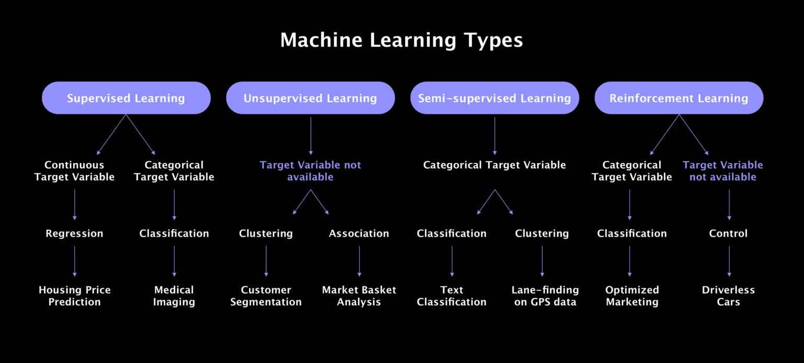

- # Machine learning from scratch 

- ## Goals
    1. Coming up with an workflow for understanding algorithms (algorithm bible).
    2. Pushing myself more in the direction of machine learning.
    3. Gaining solid knowledge in machine learning algorithms.
    4. Providing other people a framework for learning machine learning.

- ## Approach
    - ### 1. Writing down all the algorithms I wanna implement
        - taken from https://www.spiceworks.com/tech/artificial-intelligence/articles/top-ml-algorithms/
        1. Linear regression 
        2. Logistic regression
        3. Decission trees 
        4. Support vector machines (SVMs)
        5. Naive Bayes algorithm
        6. KNN classification algorithm 
        7. K-Means
        8. Random forest algorithm 
        9. Artificial neural networks (ANNs)
        10. Recurrent neural networks (RNNs)
    - ### 2. Write down my template structure for a notebook
        1. Questions 
            - What is the Wikipedia link to the algorithm?
            - Which type of machine learning is it?
            - What is the best YouTube video explaining the algorithm?
            - What is the best picture which describes the algorithm?
            - What are three use cases for which the algorithm was used for? 
        (now I put this questions into Anki)
        2. Search sample data to test my algorithm
        3. From scratch implementation
        5. Implementation with PyTorch
        6. Pro implementation with PyTorch? 
    - ### 3. Create template structure notebook
    - ### 4. Create first algorithm notebook 

- ## Notes
    - 